/-------------------------------------------------------------\
=: (X)  (-)  (<>)    ChrisWu -- -zsh -- 80x24                 |
=:............................................................|
=: ChrisWu@Macbook-Pro ~ % cat intro.txt                      |
=:                                                            |
=: Name: Chris Wu                                             |
=: Pronouns: He/Him                                           |
=: Occupation:                                                |
=:    > Studying CS & ML @ UMD; Stats & CompFin Minors        |
=: Prev:                                                      |
=:    > ML Student Researcher @ UMD MACHAMP Lab               |
=:    > Software Engineering Intern (ML) @ BASF-ECMS          |
=: Certifications:                                            |
=:    > AWS Certified Solutions Architect Associate SAA-CO3   |
=:    > AWS Certified Developer Associate DVA-C02             |
=: Interests:                                                 |
=:    > Building Applied ML systems                           |
=:    > Building scalable software systems & infrastructure   |
=:    > Automating daily workflows                            |
=:    > Badminton, Running, Concerts                          |
=: Contact:                                                   | 
=:    > Linkedin: https://www.linkedin.com/in/chriswu06       |
=:    > Email: chriswu.cwu06@gmail.com                        |
=:                                                            |
=: ChrisWu@Macbook-Pro ~ % _                                  |
\=============================================================/

  
  

<picture>
  <source media="(prefers-color-scheme: dark)" srcset="https://raw.githubusercontent.com/chriswu06/chriswu06/output/github-snake-dark.svg">
  
</picture>
